# Object Detection and Tracking on Raspberry Pi 5

Built during [EPS 2026 — Engineering Project Sprint](https://eps.kpi.ua/) at Igor Sikorsky Kyiv Polytechnic Institute.

## Our team

<table align="center" border="0" style="border: none">
  <tr style="border: none">
    <td align="center" width="20%" style="border: none">
      <a href="https://www.linkedin.com/in/anatolii-romanin-5a9b54290/"></a><br>
      <sub><b><a href="https://www.linkedin.com/in/anatolii-romanin-5a9b54290/">Anatolii&nbsp;Romanin</a></b></sub><br>
      <sub>detection</sub>
    </td>
    <td align="center" width="20%" style="border: none">
      <a href="https://www.linkedin.com/in/%D0%B4%D0%B0%D1%80-%D1%8F-%D1%87%D1%96%D1%80%D0%BA%D1%96%D0%BD%D0%B0-7b93509a/"></a><br>
      <sub><b><a href="https://www.linkedin.com/in/%D0%B4%D0%B0%D1%80-%D1%8F-%D1%87%D1%96%D1%80%D0%BA%D1%96%D0%BD%D0%B0-7b93509a/">Daria&nbsp;Chirkina</a></b></sub><br>
      <sub>tracking</sub>
    </td>
    <td align="center" width="20%" style="border: none">
      <a href="https://www.linkedin.com/in/olehsamoilenko/">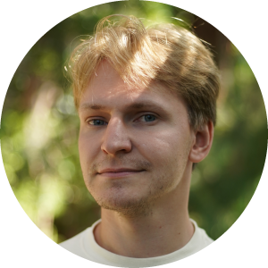</a><br>
      <sub><b><a href="https://www.linkedin.com/in/olehsamoilenko/">Oleh&nbsp;Samoilenko</a></b></sub><br>
      <sub>testing</sub>
    </td>
    <td align="center" width="20%" style="border: none">
      <a href="https://www.linkedin.com/in/%D0%BC%D0%B8%D1%80%D0%BE%D1%81%D0%BB%D0%B0%D0%B2-%D0%BF%D0%B0%D0%BB%D0%B0%D0%BC%D0%B0%D1%80%D1%87%D1%83%D0%BA-8a8856440/">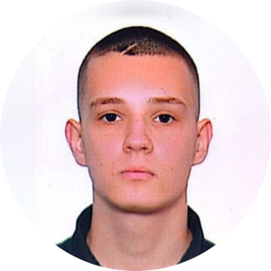</a><br>
      <sub><b><a href="https://www.linkedin.com/in/%D0%BC%D0%B8%D1%80%D0%BE%D1%81%D0%BB%D0%B0%D0%B2-%D0%BF%D0%B0%D0%BB%D0%B0%D0%BC%D0%B0%D1%80%D1%87%D1%83%D0%BA-8a8856440/">Myroslav&nbsp;Palamarchuk</a></b></sub><br>
      <sub>tracking</sub>
    </td>
    <td align="center" width="20%" style="border: none">
      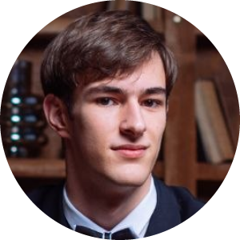<br>
      <sub><b>Milan&nbsp;Ilich</b></sub><br>
      <sub>training</sub>
    </td>
  </tr>
</table>

---

## Object detection

Dataset: [VisDrone](https://github.com/VisDrone/VisDrone-Dataset)

<p align="center">
  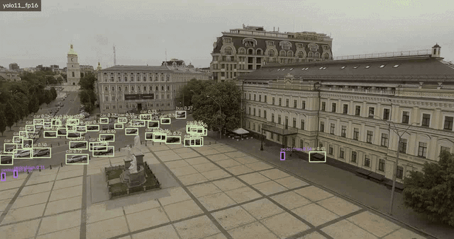
</p>

<table>
  <tr>
    <td width="50%">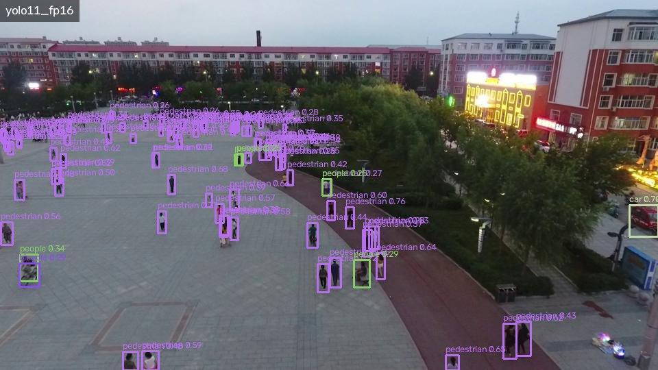</td>
    <td width="50%">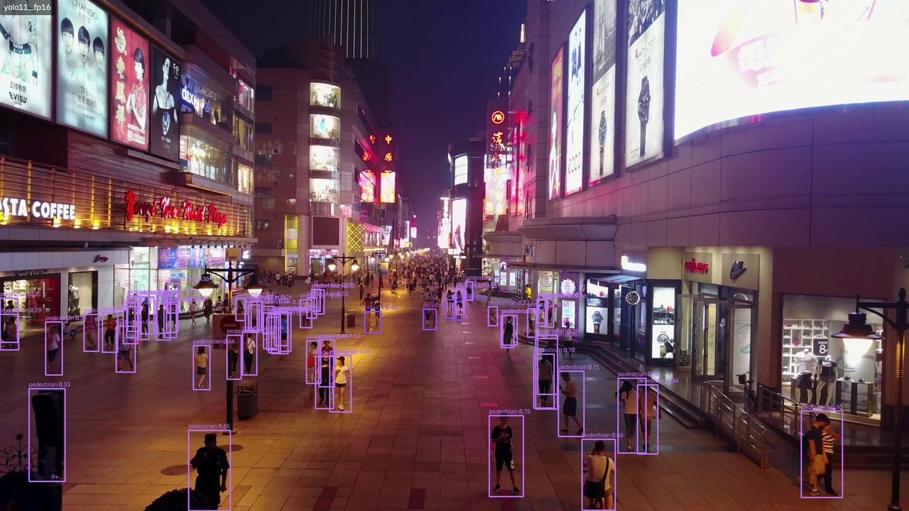</td>
  </tr>
  <tr>
    <td width="50%">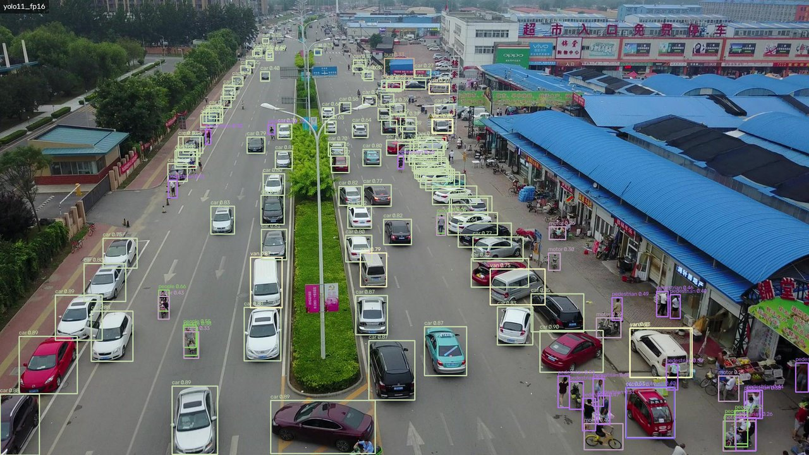</td>
    <td width="50%">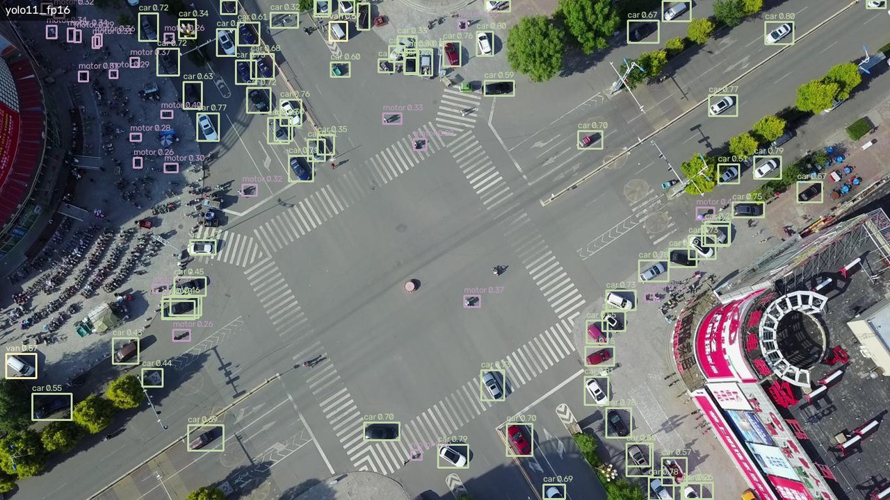</td>
  </tr>
</table>

## Detector comparison

| Detector | Params | FPS ↑ | mAP@0.5 ↑ |
|---|---:|---:|---:|
| YOLO11n | 2.6M | 12.92 | 0.250 |
| YOLO11n FP16 | 2.6M | 13.11 | 🟢 0.250 |
| YOLO11n INT8 | 2.6M | 12.57 | 0.236 |
| YOLO26n | 2.4M | 13.91 | 0.244 |
| NanoDet-Plus-m | 1.17M | 🟢 21.48 | 0.180 |
| Yolo-FastestV2 | 0.25M | 56.12 | 🔴 0.022 |

FPS measured on 500 frames of a drone video; mAP@0.5 on 500 images of VisDrone2019-DET test-dev.

**The same conditions for every model:**

- the same dataset (VisDrone)
- the same number of training epochs (50)
- tested on a Raspberry Pi 5
- temperature kept under control (80 °C at most)

**Takeaways:**

- There is no "best" detector. Every choice trades speed against accuracy.
- FP16 is a free optimization: same mAP, slightly faster.
- A bigger model usually means higher accuracy.

Full results: [summary.md](summary.md) · how the benchmarks work: [test_framework/TEST_FRAMEWORK.md](test_framework/TEST_FRAMEWORK.md)

## Object tracking

We compared **ByteTrack** and **SORT_fast** by the number of **ID switches**. ByteTrack switched IDs less often, so we chose it.

<p align="center">
  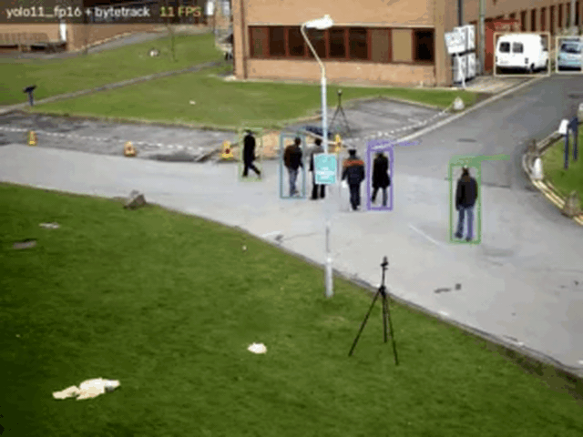
</p>

## Live demo

Our own video, processed live on the Raspberry Pi 5 from its camera.

<table align="center">
  <tr>
    <td align="center" width="50%">
      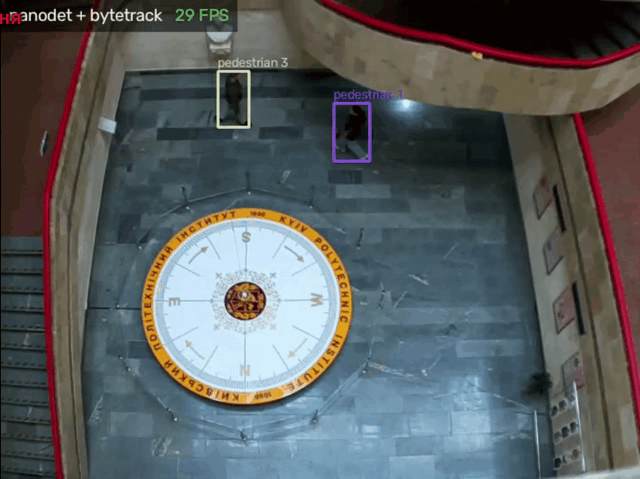<br>
      <b>NanoDet + ByteTrack</b>
    </td>
    <td align="center" width="50%">
      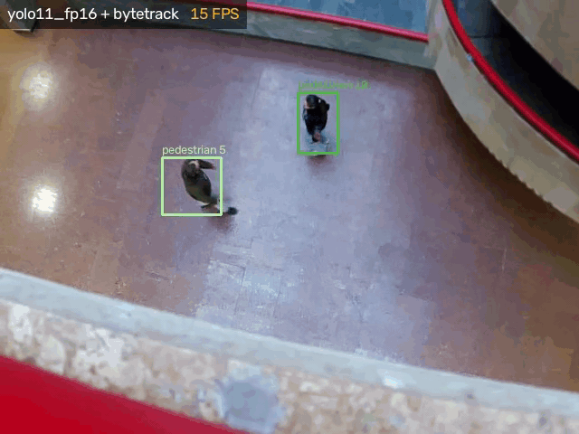<br>
      <b>YOLO11 FP16 + ByteTrack</b>
    </td>
  </tr>
</table>

## Quick start

```bash
python stream.py -d yolo11_fp16 --tracker bytetrack           # Pi camera -> YOLO11 FP16 -> ByteTrack -> http://<pi-ip>:5000
python stream.py -d nanodet --classes pedestrian,car           # only these classes
python stream.py -s input/street.avi -d yolo11 --save out.mp4  # video -> video, every frame detected
python stream.py -s input/0000001.jpg -d yolo8 --save out.jpg  # image -> image
python stream.py -d yolo8 --tracker bytetrack -v 4             # low-power mode: at most 4 detections per second
```

| Option | Meaning |
|---|---|
| `-s`, `--source` | `picam` (default), a video file or an image file |
| `-d`, `--detector` | a model from `models/`; omit it for a plain camera stream |
| `--tracker` | `none` (default), `bytetrack` or `sort_fast` |
| `--classes` | keep only these classes, comma-separated |
| `--conf` | confidence threshold (default: 0.25 for YOLO, 0.35 for NanoDet, 0.3 for Yolo-FastestV2) |
| `--web [PORT]` | MJPEG stream for the browser, port 5000 by default; on unless `--save` is given |
| `--save FILE` | write a video (`.mp4`) or an image (`.jpg` / `.png`) |
| `-v [N]` | camera only: run the detector at most N times per second (6 by default) to cut power draw and heat, for example on a power bank |

Detectors: `nanodet`, `nanodet_int8`, `yolo8`, `yolo8_int8`, `yolo11`, `yolo11_fp16`, `yolo11_int8`, `yolo26`, `yolo26_fp16`, `yolo26_int8`, `yolo_fastestv2`. Run `python stream.py -h` for every option.

To run the benchmarks on the Pi:

```bash
python test_framework/accuracy.py      # mAP on VisDrone test-dev
python test_framework/performance.py   # FPS
```

## Repository layout

| Path | What it does |
|---|---|
| [stream.py](stream.py) | entry point: source → detector → tracker → web stream and/or file |
| [pipeline.py](pipeline.py) | loads detectors; runs the live (threaded) or offline frame loop |
| [camera.py](camera.py) | Pi CSI camera (through `rpicam-vid`), video and image sources |
| [yolo_detector.py](yolo_detector.py), [nanodet_detector.py](nanodet_detector.py), [yolo_fastest_detector.py](yolo_fastest_detector.py) | ncnn detector adapters |
| [tracker.py](tracker.py), [byte_tracker.py](byte_tracker.py), [sort_fast.py](sort_fast.py) | trackers |
| [web_stream.py](web_stream.py), [output.py](output.py), [stats.py](stats.py) | MJPEG server, box drawing and recording, FPS overlay |
| [models/](models/) | ncnn models (`*_ncnn`) and their source weights (`models_pt/`) |
| [test_framework/](test_framework/) | accuracy and FPS benchmarks for the Pi |
